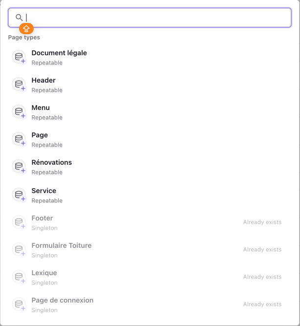

# 📄 Comment créer une page / un élément

Pour créer un document, il suffit de cliquer sur le bouton en haut à droite, de couleur violette :

Quand on clique, une fenêtre s’ouvre avec plusieurs **types de pages** à choisir. Voici ce que cela veut dire :  
Chaque type représente une sorte de “boîte” spéciale pour ranger un certain type de contenu. Par exemple : une boîte pour les services, une autre pour les menus, etc.

> ⚠️ Important : Une "page" dans Prismic n'est pas toujours une vraie page visible sur le site. C’est parfois juste une fiche pour organiser du contenu qui sera affiché dans d’autres pages (comme un service ou un menu).

---

## 📦 Détail de chaque type de page

### 🧾 **Document légale**

Contient les textes importants comme les mentions légales, les conditions d'utilisation ou la politique de confidentialité.  
🔁 _Repeatable_ (peut être dupliqué et ajouté plusieurs fois)

---

### 🧱 **Header**

Gère le haut de toutes les pages (le bandeau avec le logo, le menu, etc.)  
🔒 _Singleton_ (il n’en existe qu’un seul, déjà créé)

---

### 📋 **Menu**

Liste les liens vers les différentes sections du site (comme “Accueil”, “Prestations”, “Contact”, etc.)  
🔁 _Repeatable_ (plusieurs menus possibles, par exemple un pour le header et un pour le footer)

---

### 📄 **Page**

C’est une page “classique” avec un titre, du texte, des images. Exemple : une page “À propos”, une page “Nos réalisations”, etc.  
🔁 _Repeatable_ (on peut créer autant de pages que nécessaire)

---

### 🛠️ **Rénovations**

Contenu spécifique qui décrit une rénovation (un chantier, une réalisation, etc.)  
🔁 _Repeatable_

---

### 🧰 **Service**

Contient la description d’un service proposé par CouvrUp (ex. nettoyage toiture, démoussage, etc.)  
🔁 _Repeatable_

---

### 🔻 **Footer**

Le bas de page du site (adresse, liens, réseaux sociaux, etc.)  
🔒 _Singleton_ (il n’en existe qu’un seul, déjà créé)

---

### 🧾 **Formulaire Toiture**

C’est la fiche spéciale pour gérer le formulaire d’estimation toiture.  
🔒 _Singleton_

---

### 📚 **Lexique**

Petit dictionnaire qui explique des termes techniques ou spécifiques liés aux travaux.  
🔒 _Singleton_

---

### 🔐 **Page de connexion**

C’est la page utilisée pour permettre à un utilisateur de se connecter à un espace privé.  
🔒 _Singleton_

---

## ✅ Résumé

- Un type de page = une catégorie de contenu.
- Certains types peuvent être créés plusieurs fois (_repeatable_), d’autres existent une seule fois (_singleton_).
- Chaque contenu peut ensuite être modifié ou complété selon les besoins du site.

> Une fois le type choisi, un formulaire s’ouvre pour saisir les textes, images ou options de cette page. Le contenu peut ensuite être enregistré en brouillon ou publié immédiatement.
