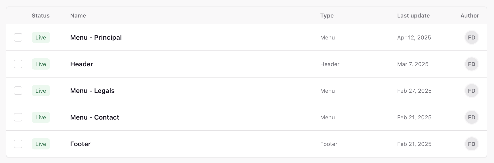
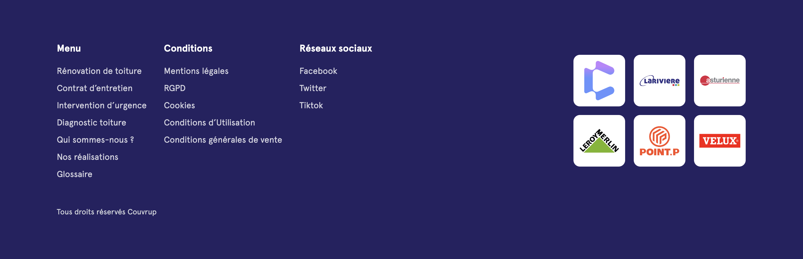
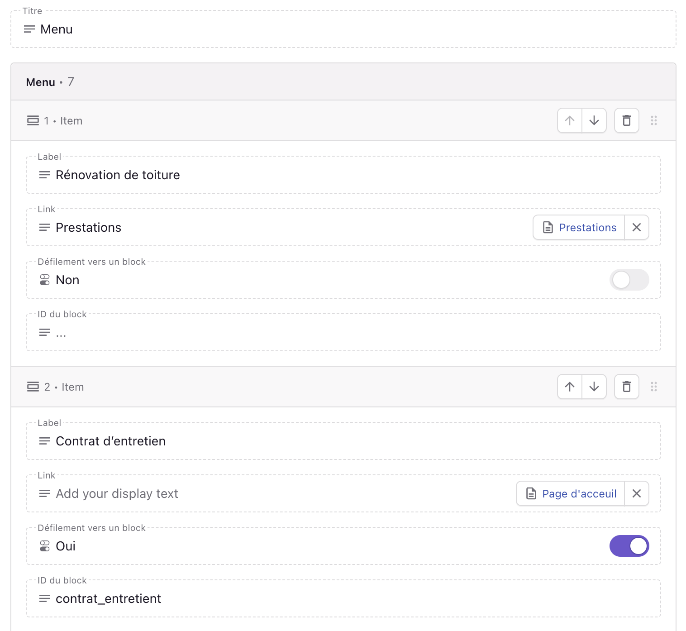

# Les menus

Les menus c'est ce qui permet de naviguer directement sur le site. On peut voir que pour l'instant il y a ces menus qui existent :

Voici a quoi correspondent les différents menus listés sur la page :

- Menu - principal : Le menu qui se trouve dans la navigation principale du site.
  

- Header : Menu legals. qui se retrouve dnas le footer et qui permet de naviguer sur les pages légales.
- Menu Contact : Menu qui se retrouve dans le footer et qui permet de contacter le Couvrup, réseaux socuaix etc....
- Footer : qui permet d'ajouter plusieurs menus dans le footer ansi que de mettre des logos partenaires :
  

## Comment créer / modifier un menu ?

- Comme on peut le vour sur l'image on a la possibilité de nommer le menu (important par exemple si on le place dans le footer)
- On aégalement la possibilité d'ajouter des éléments dans le menu avec un label et un lien. Le lien se fait vers une page dusite que l'on peut choisir en cliquand ici :

<video width="100%" height="auto" controls>
  <source src="/video/link_page.mp4" type="video/mp4" />
  Votre navigateur ne supporte pas la lecture de vidéos.
</video>
