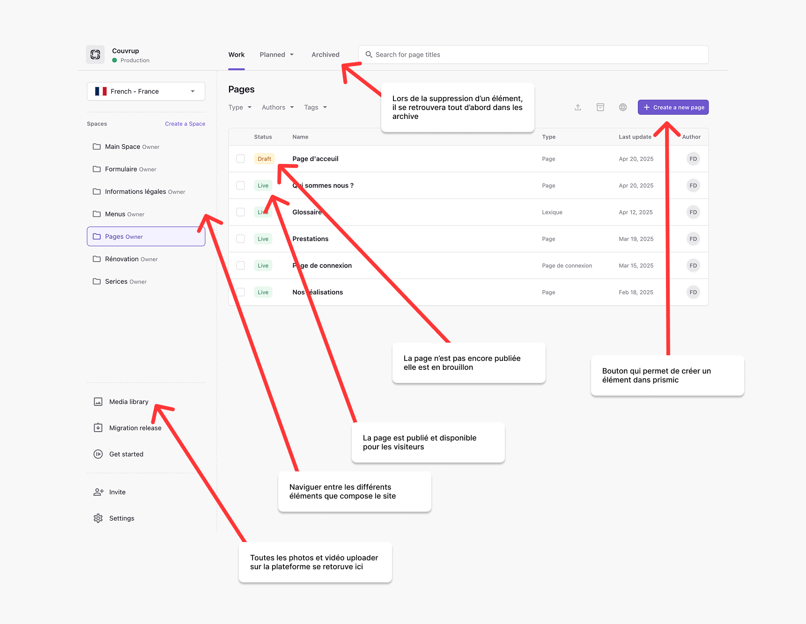

# 🖥️ L'interface de Prismic

Voici une présentation simple de l’interface **Prismic**, l’outil utilisé pour gérer tout le contenu du site internet de CouvrUp.

Prismic fonctionne comme un **classeur numérique organisé** : chaque section correspond à une partie du site, avec des pages, des menus, des textes ou des images facilement accessibles et modifiables.

---

### 🗂️ Présentation des principales zones de l’interface :

- **Colonne de gauche – Navigation**

  - Permet d’accéder aux différentes sections du contenu : pages, menus, services, informations légales, formulaire, etc.
  - La section **Media library** contient toutes les photos et vidéos utilisées sur le site.

- **Bouton violet “Create a new page”**

  - Sert à créer un nouveau contenu (ex. une page ou une section).
  - Chaque nouveau contenu peut être configuré en quelques clics avec des modèles prédéfinis.

- **Liste centrale – Gestion des pages**

  - Montre tous les contenus existants classés par statut :
    - **Draft** (brouillon) : page non publiée, en cours d’édition.
    - **Live** : page publiée, visible par les visiteurs du site.

- **Barre de recherche en haut**

  - Permet de retrouver rapidement une page spécifique en tapant son titre.

- **Archives**
  - Lorsqu’un élément est supprimé, il est d’abord déplacé ici avant d’être supprimé définitivement.

---

### 📷 La Media Library

La **Media Library** regroupe tous les fichiers médias :

- Images
- Vidéos
- Logos ou visuels utilisés dans les pages

Depuis cette bibliothèque, il est possible d'ajouter de nouveaux fichiers ou de réutiliser ceux déjà en place.

---

### ✅ Résumé

L’interface de Prismic est conçue pour être intuitive. Elle permet de gérer l’ensemble du contenu du site **sans compétence technique** : ajout de pages, mise à jour des textes, gestion des menus ou des images. L’objectif est de garantir une autonomie totale dans la gestion du site CouvrUp.

> Toute modification effectuée dans Prismic peut être publiée immédiatement ou conservée en brouillon jusqu’à validation.
