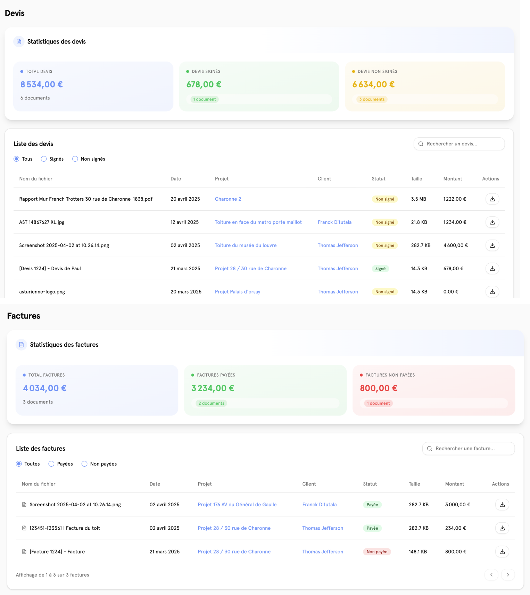
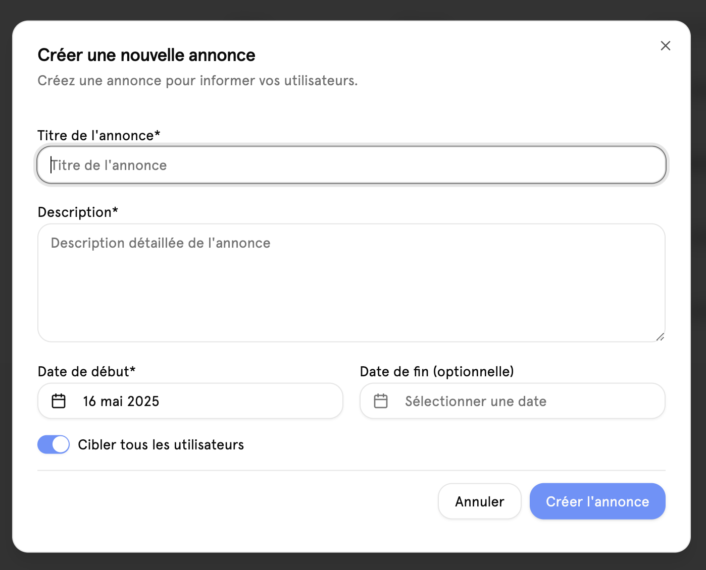
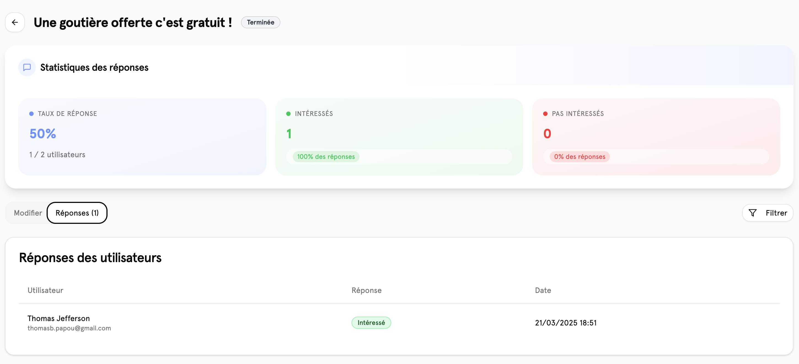
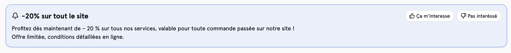

# 📄 Annonces

## Aperçu

Les annonces permet aux admins, de créer des offres promotionnelles ou informatives, qui seront affichées sur l'interface du client.

## Créer une annonce

Pour créer une annonce, il faut remplir les champs suivants :

- Titre
- Description
- Date de publication
- Date de fin
- La liste des utilisateurs qui peuvent voir cette annonce

Une fois l'annonce créée, il est possible de la modifier, de la supprimer ou de la publier. Les statistiques sont également affichés afin de pouvoir suivre l'évolution de l'annonce.

## Notifications

Les noitifications sont envoyées aux utilisateurs qui ont été sélectionnés lors de la création de l'annonce.

