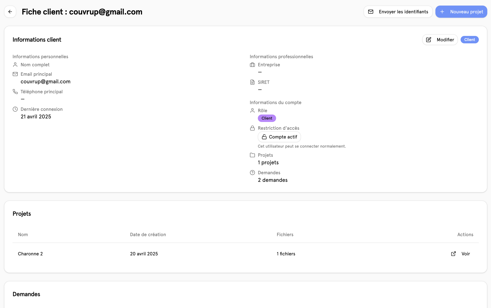

# 📄 Clients

## Aperçu

Retrouvez ici la liste de tous les clients.

## Créer un nouveau client

pour cela, nous avons besoin de informations qui sont écrites ci-dessous. Le numéro de téléphone n'est pas obligatoire.

Lorsque l'on crée un nouvel utilisateur manuellement, L'utilisateur n'a pas la possibilité d'accéder directement à son compte pour ce faire, il faut alors cliquer sur le bouton "envoyer les identifiants" Pour que l'utilisateur reçoivent un mail avec son mail et son mot de passe pour pouvoir se connecter.

## Informations du client

sur cette page, nous pouvons retrouver toutes les informations liées à l'utilisateur. Avec la possibilité de pouvoir les modifier, nous pouvons y voir à la fois les projets qui sont liés, les demandes Ainsi que les statistiques financiers et quantitatifs de l'utilisateur
