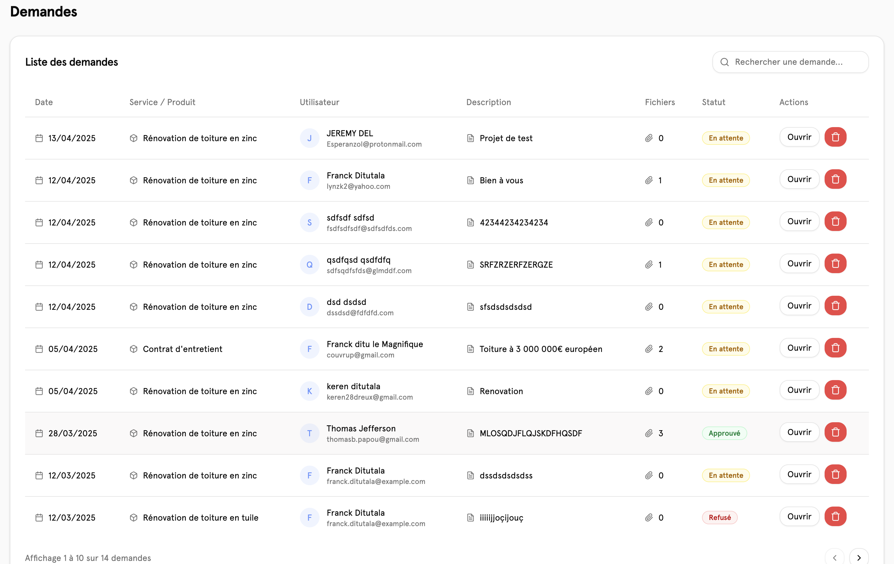
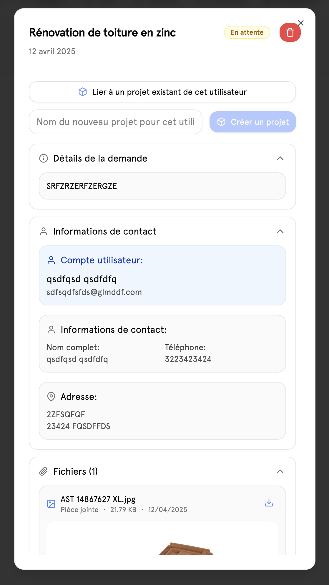

# 📄 Demandes

## Aperçu

la page de montre regroupe toutes les demandes qui ont été réalisées par les utilisateurs. Ici on a la possibilité de consulter chacune des demandes avec les détails fournis par l'utilisateur ainsi que les fichiers ont été transmis.

## Consultation d'une demande

## Information

pour pouvoir consulter une demande, il faut cliquer sur le bouton ouvrir. On peut y voir afficher trois sections la première fait référence à la demande du client, la seconde à toutes les informations le concernant et la troisième les fichiers.

### Lié a un projet

une demande est automatiquement liée à un utilisateur. Si la demande nécessite d'être traité, Il faut lier la demande à un projet déjà existant ou créer un nouveau projet, ce qui va permettre de traiter la demande des clients de manière ordonnée.

Il y a aussi la possibilité de pouvoir supprimer une demande
