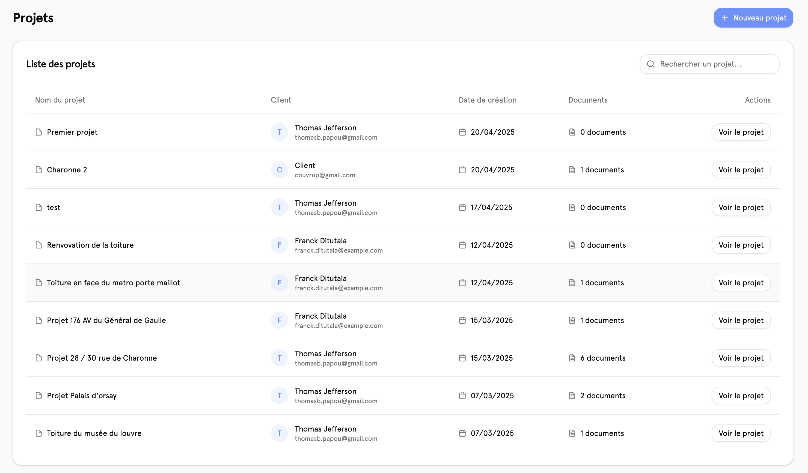
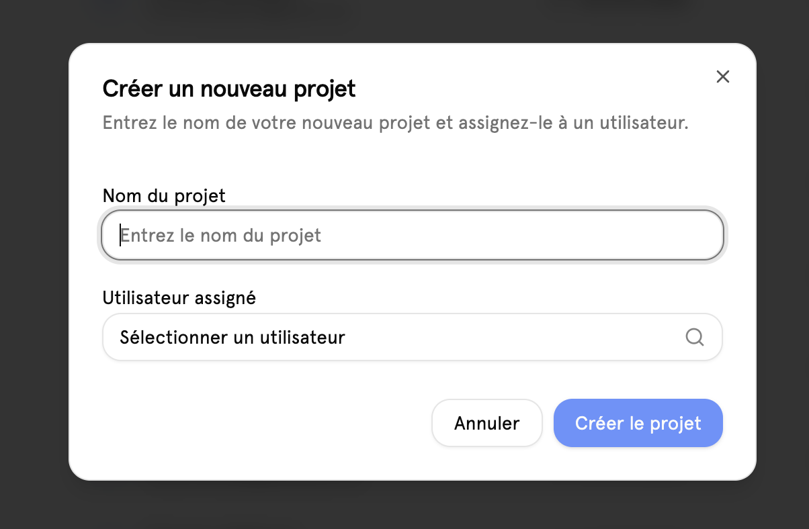
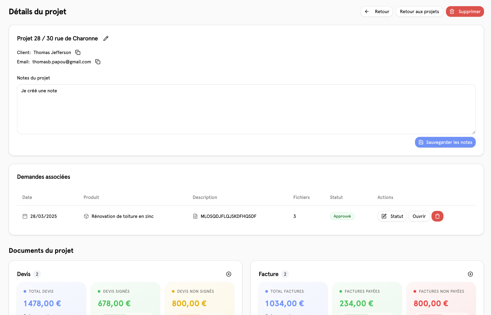
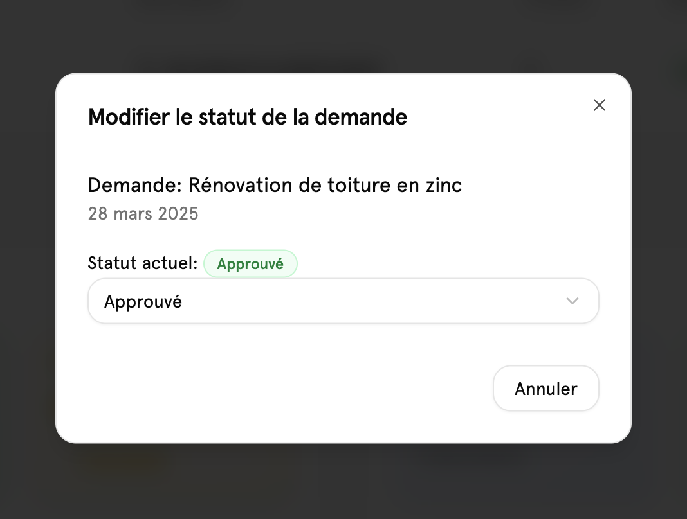
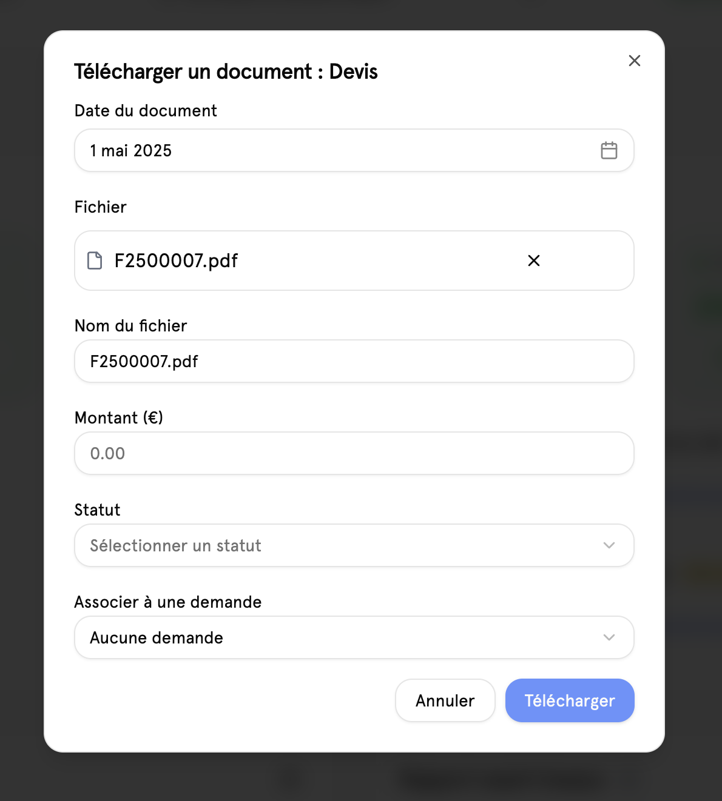

# 📄 Projets

## Aperçu

la page projet regroupe l'ensemble de tous les projets qui ont été créé sur la plate-forme par les visiteurs et les clients du site. Comment on peut le voir en haut à droite, on peut y apercevoir un bouton bleu qui permet de créer un nouveau projet.

## Création d'un nouveau projet

Pour pouvoir créer un nouveau projet, il faut deux choses, donner un nom ainsi que de lier le projet à un utilisateur.

## Projet

Un projet se décompose en plusieurs parties. La première partie regroupe toutes les informations du projet y compris celle du client, la seconde partie présente l'ensemble des demandes qui ont été faite par les clients et la dernière au Groupe, l'ensemble de tous les documents relatifs au projet.

### Note du projet

Les notes du projet permet à n'importe quel moment de pouvoir ajouter des notes pour le projet. Ces notes sont uniquement visibles par l'admin.

### Demandes du projet

il est possible de modifier le statut d'une demande directement depuis la page projet. Une fois le statut modifié, il sera également répercuté côté client.

### Documents du projet

il est possible d'importer des documents dans le projet. Pour cela il faut cliquer sur le petit bouton plus en haut à droite d'une catégorie. Ensuite il faut venir sélectionner une date qui correspond à la date de création du fichier ainsi que le fichier lui-même le nom du fichier sera leur demander et en fonction du type de fichiers, certains paramètres supplémentaires peuvent être affichés Notamment pour les devis et les factures.

comme on peut le voir sur l'image précédente, il y a la possibilité de lier spécifiquement un devis ou une facture à une demande, cela permet de faire les calculs statistiques qui vont permettre de relier chaque produit à des statistiques financiers.
